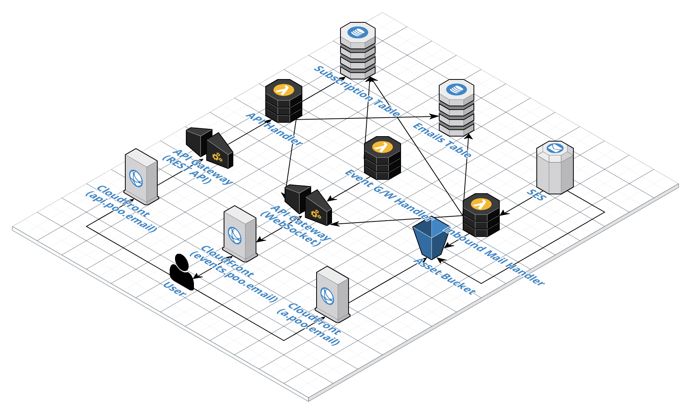
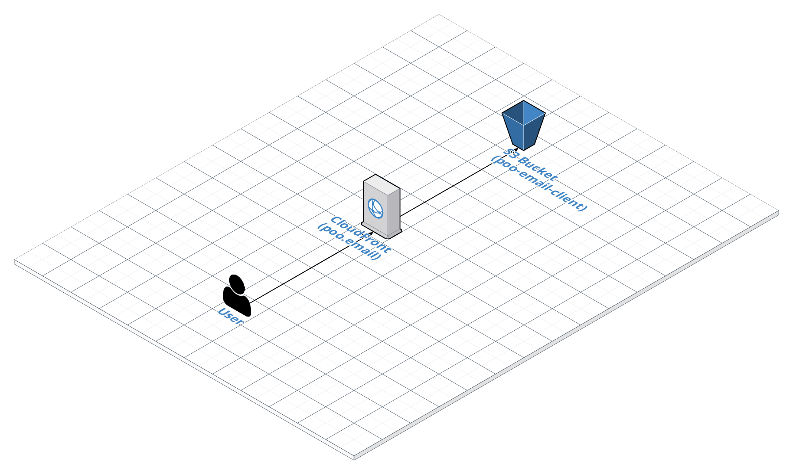
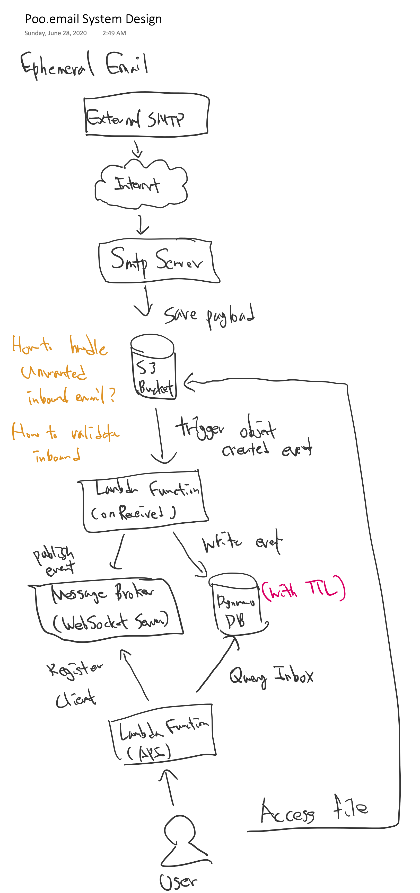
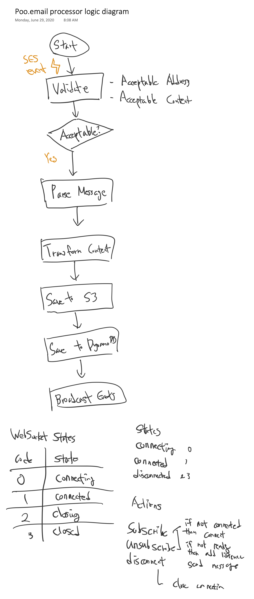
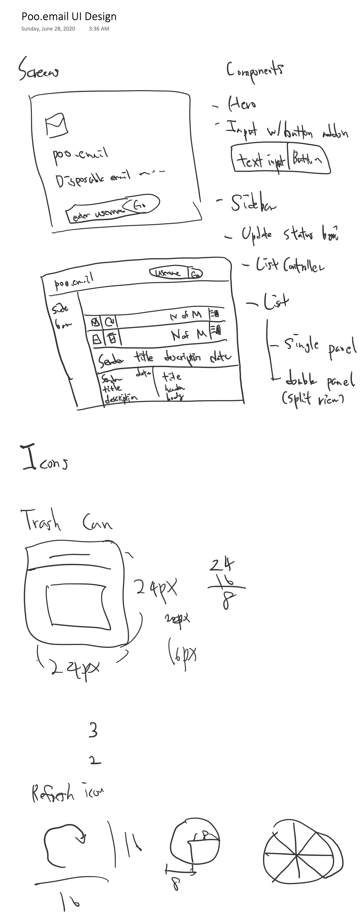

# poo.email

[poo.email](https://poo.email) is a disposable email service, which is powered by 100% Serverless Architecture.

There are no resources to provision or manage. Pay as you go, and Scales automatically. 

All inboxes are public, and you can use your username whatever you want.

All received emails will be deleted automatically after 24 hours.    

## Live Demo

https://poo.email/

or Send a mail to [example@poo.email](mailto:example@poo.email), then Navigate to [Inbox of example@poo.email](https://poo.email/#/inbox/example)!

## Key Features

- Receive email
- View Inbox
- View/Download Attachments
- Real-time updates via WebSockets 

## Project Structure

- [Client](client) - All things about Client Application, which is React App currently
- [Server](server) - All things about Server Application, which are Lambda handlers and contain business logic.
- [Infra](infra) - All things about IaC

## API Documentation

OpenAPI based Documentation is available:

http://petstore.swagger.io/?url=https%3A%2F%2Fapi.poo.email%2Fapi%2Fdocs

## Deployment Guide

See [infra/README.md](infra/README.md)

## Infrastructure Diagrams

#### Server

#### Client

## Dirty Sketches

 

## Related

- [aws-cdk-ses-domain-identity](https://github.com/mooyoul/aws-cdk-ses-domain-identity) - Constructs for provisioning and referencing domain identities which can be used in SES RuleSets and Actions Construct.
                                                                                        

## License
[MIT](LICENSE)

See full license on [mooyoul.mit-license.org](http://mooyoul.mit-license.org/)

